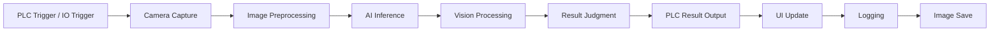

  

# RANI (BISON Edge Vision Framework)

Real-time edge AI Networked Inspection Platform for NVIDIA Jetson

**RANI (Real-time AI Networked Inspection)** 는  
**NVIDIA Linux 기반 Edge Device 전용 산업용 AI 머신비전 검사 플랫폼**입니다.

RANI는 **Jetson JetPack 환경에서 동작하는 경량 Edge AI 검사 플랫폼**으로  
카메라 이미지 획득, AI 추론, 검사 로직, PLC 통신, 데이터 기록을 하나의 시스템으로 통합합니다.

이를 통해 **Linux 기반 Edge 장비에서 실시간 공정 검사와 데이터 분석을 수행하며  
소형 산업 설비 및 임베디드 환경에 최적화된 머신비전 검사 시스템을 제공합니다.**

------------------------------------------------------------------------

# 📘 Features

## 🧠 Core Inspection System

RANI는 **소형 Edge Device에서 동작하도록 설계된 AI 기반 검사
파이프라인**을 제공합니다.

### Flexible Camera Integration

- Basler GigE 카메라
- 다양한 산업용 카메라 확장 구조
- Soft Trigger / Continuous Acquisition 지원

### AI Inspection Engine

-   Object Detection
-   Segmentation
-   Classification
-   QR Code Detection

### Hybrid Inspection System

-   AI 기반 검사
-   Rule 기반 검사
-   AI + Rule Hybrid 검사 구조

### Real-time Inspection Control

-   PLC 기반 검사 사이클 제어
-   실시간 검사 결과 처리
-   Edge Device 환경에 최적화된 고속 검사

------------------------------------------------------------------------

## 🔍 Inspection Monitoring

Edge 환경에서도 검사 결과를 효율적으로 확인하고 분석할 수 있는 기능을
제공합니다.

-   검사 결과 실시간 표시
-   검사 상태 모니터링
-   검사 이미지 확인
-   ROI 기반 검사 결과 시각화

------------------------------------------------------------------------

## 📂 Logging System

Edge Device 환경에서도 안정적으로 동작하는
**경량 비동기 로그 기록 시스템**을 제공합니다.

### 지원 로그 형식

-   CSV
-   Image (PNG / JPG / BMP)

### 기록 데이터

-   검사 결과
-   AI 추론 결과
-   ROI 정보
-   검사 시간
-   검사 이미지

------------------------------------------------------------------------

## 🖼️ Image Viewer

검사 이미지를 확인할 수 있는 기능을 제공합니다.

-   검사 이미지 확인
-   ROI Overlay 표시
-   검사 결과 시각화

------------------------------------------------------------------------

## ⚙️ Core Technology

| Category | Description |
|---|---|
| Core Engine | High-performance C++ based vision processing engine |
| AI Inference | GPU accelerated AI inference engine |
| Vision Processing | Optimized industrial image processing pipeline |
| Device Integration | Industrial camera and automation device integration |
| Platform Support | Edge AI platforms and Linux environments |
| System Logging | Inspection data and image logging system |

------------------------------------------------------------------------

## 🧩 System Architecture

TITAN Edge Vision Framework는 다음과 같은 주요 모듈로 구성됩니다.

- **Application Layer**  
  검사 시스템 UI 및 사용자 인터페이스

- **Inspection Pipeline**  
  이미지 획득부터 검사 결과 생성까지의 처리 흐름 관리

- **Device Interface**  
  카메라, PLC, 조명 등 산업 장비 연동

- **Vision Tools**  
  AI 기반 검사 및 전통적인 비전 알고리즘

- **System Infrastructure**  
  설정 관리, 데이터 I/O, 로그 처리

------------------------------------------------------------------------

## 🔄 Inspection Flow

RANI는 **Edge Device 환경에서 동작하는 실시간 검사 파이프라인**을 제공합니다.

------------------------------------------------------------------------

# 🎯 Design Goals

RANI 플랫폼은 다음 목표를 기반으로 설계되었습니다.

-   Edge Device 기반 산업용 검사 시스템
-   소형 장비에서 동작 가능한 경량 플랫폼
-   Jetson 기반 Edge AI 검사 환경 최적화
-   고속 검사 사이클 지원
-   AI + 머신비전 통합 구조
-   확장 가능한 모듈형 아키텍처

------------------------------------------------------------------------

# 👨‍💻 Author

**JangHyeok Choi (최장혁)**\
Vision Solution Team / Assistant Manager @ BISON\
📧 Contact: jhchoi@bison0507.com

------------------------------------------------------------------------

# 🪪 License
본 프로젝트는 BISON의 자산이며, 무단 복제, 배포 및 사용은 엄격히 금지됩니다.

Copyright © BISON. All rights reserved.
